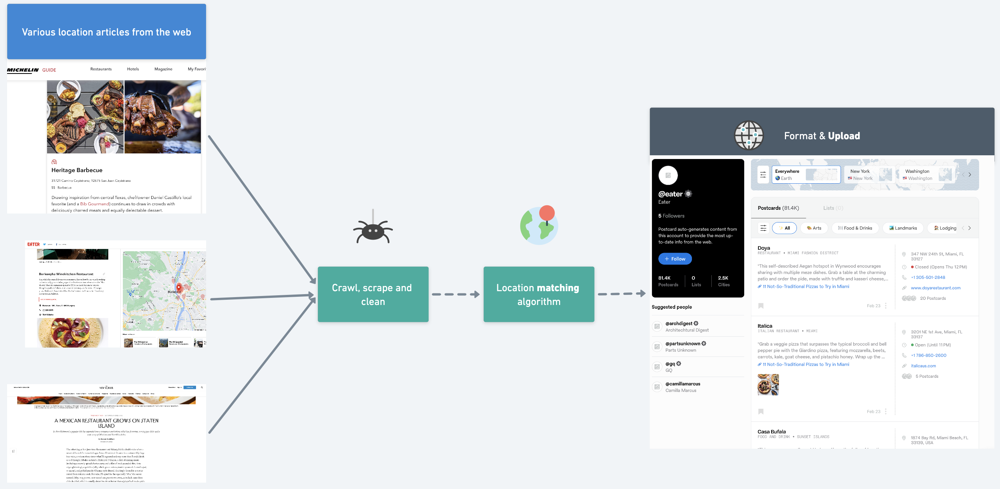
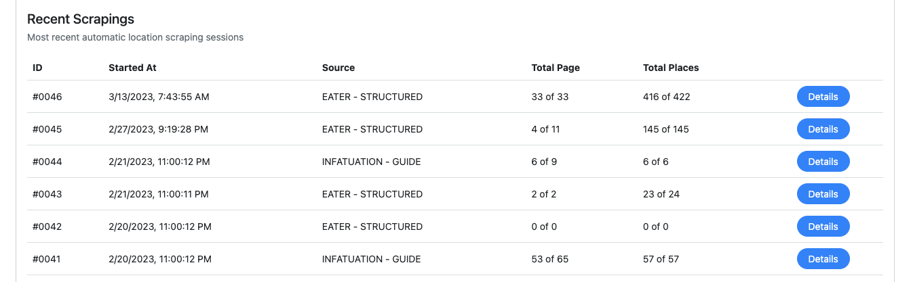

# Welcome to Journo

> Effortlessly extract, analyze, and upload diverse article locations to
  Postcard. Seamless end-to-end website crawling, extract precise locations, and
  cross-reference with external sources.

<figure></figure>

[User interface demo here](https://postcard.quantumteknologi.com) (only displays 2/18 data source).
<figure></figure>

Here's one example of a curated [profile of Eater](https://www.postcard.inc/@eater) consisting of >80k places extracted by Journo.

## Seamless end-to-end information extracting tool

Journo was built to accommodate one of my client's ([Postcard](https://postcard.inc)) need for a constant stream of place recommendation data from various sources.

Postcard is an app that allows you to discover, track and share places. Think Google Maps with place curation from sources such as [Michelin](https://guide.michelin.com/us/en/best-of/best-barbecue-in-california-michelin-guide-bib-gourmand), [Eater](https://www.eater.com/maps/best-budapest-restaurants-18), [NewYorker](https://www.newyorker.com/magazine/2022/12/19/a-mexican-restaurant-grows-on-staten-island) and more. Here's one example of a curated [profile of Eater](https://www.postcard.inc/@eater) consisting of >80k extracted places.

Journo is right at the heart of Postcard's core problem, it is an end-to-end web location extracting tool, handling web crawling, HTML or JSON parsing, cross-referencing with trusted location sources, data cleaning, filtering, and preparing eligible information for integration with Postcard. Journo streamlines the workflow at Postcard, saving us time and effort while delivering exceptional results.

To view detailed documentation of Journo's key feature, visit the following links:
- [How location extraction/matching works in Journo](welcome-to-journo/cutting-edge-cross-referencing-power.md)
- [How to extend Journo](welcome-to-journo/code-example.md)

### Easy to Setup, Easy to Config

Journo enables you to manage tasks effectively and efficiently. It's designed to function on various hardware configurations, and various website to scrape from.

Key features include:
- *Adaptable to your needs*: Journo can be tailored to meet your specific requirements, enhancing its performance and providing flexibility to handle location information tasks.
- *Flexible Parallelization Configuration*: Journo's functionality can be customized to match your hardware setup. By adjusting `THREAD_LIMIT`, you can set the parallelization level. This is particularly useful when dealing with large datasets, like matching thousands of place information.

With Journo, you have the power to manage and manipulate your location data as per your needs. Uncover the full capabilities of Journo to address your location information needs.

## Built to be Extended

Instead of relying on a fixed number of sources, you can use Journo to access location data from any number of websites. You have the power to enhance Journo's functionality according to your specific needs. You can do this by:
1. Creating a custom 'Crawler' function to explore more websites.
2. Developing a 'Parser' function to extract location data from your chosen sites.
3. Register the Source ID with the system.

Once your custom functions and Source ID are in place, let Journo take over. The tool is designed to manage complex tasks while optimizing resource use for the most beneficial outcome. You can sit back and watch as Journo unlocks the full potential of location data.

`function_mapper.py`
```python
def do_crawl(source: str):
    if source == 'EATER__STRUCTURED':
        EaterStructured.crawl()
    elif source == '{your_source_here}':
        YourSource.crawl()

def do_parse(source: str):
    if source == 'EATER__STRUCTURED':
        EaterStructured.parse()
    elif source == '{your_source_here}':
        YourSource.parse()
```

## Asynchronously Elegant

Embrace the elegance of asynchronous efficiency with Journo. Say goodbye to time wasted waiting for one source to complete before starting another. With Journo, both processes run seamlessly in parallel, devoid of any blocking or race conditions. Sit back and let Journo effortlessly handle and manage the asynchronous workflow for each source, ensuring optimal performance and maximum productivity. Experience a truly streamlined and efficient data extraction experience with Journo.

You can run multiple extract & upload processes processes concurrently, eliminating unnecessary wait times. Journo takes care of parallel execution without blocking or race conditions. It manages the asynchronous workflow for each process.

`journo_globals/apis.py`
```python
....
crawl_tasker[source] = threading.Thread(
    target=lambda: do_crawl(
        source=source,
    )
)
crawl_tasker[source].start()
....
```
