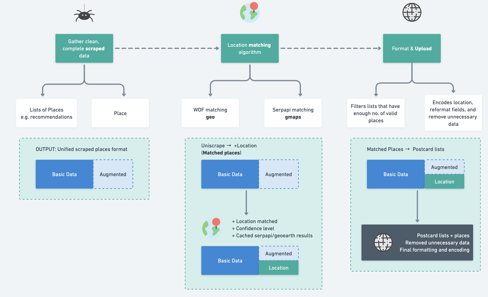

# Cutting-Edge Cross-Referencing Power

<figure></figure>

## 6 Step of Journo's Cross-Referencing&#x20;

Journo ensures place relevancy & quality by cross-referencing place information with external sources such as Serpapi and WhosOnFirst. This document outlines the algorithm clean, enhance, and complete your data, ensuring you have the most relevant and precise location information.

`do_match.py`
```python
...
# Enrich Location Name
enrich_location(place)

# Cross Matching with Serpapi
serpapi_params = generate_serp_query(place)
batch_place_location(place.serp_query)

# Cross Matching with WOF
fetch_wof_result_for_serpapi_result(serp_result_instance)

# Selecting best match across Serpapi and WOF
get_place_best_match(place)

# Clean and generate unique place_id by using Best Match's Information
place.placeId = best_match_to_pc(best_match_instance)

# Decide if the place is eligible or not by comparing the score to the Threshold
score = best_match_instance.score
if score < score_threshold:
    place.set_ignored(f"Score is lower than threshold: {score} < {score_threshold}")
    continue
...
```

### 1. Data Enrichment

Journo is complete with an NLP-driven location enrichment feature. When articles lack explicit location information, Journo steps in to extract, analyze, and enrich location names using natural language processing. Leveraging all available information about the place, Journo dynamically fills the gaps.

`enrich_location.py`
```python
nlp = spacy.load("en_core_web_trf")
...
locations = []

if page.title:
    entities = [e for e in nlp(str(page.title)).ents]
    ...
if page.description:
    entities = [e for e in nlp(str(page.description)).ents]
...
```

### 2. Cross Matching with Serpapi

Journo uses Serpapi to enrich places with Google Maps API. Journo crafts targeted queries with enriched data as input, then match it with the exact location on Google Maps.

`batch_place_location.py`
```python
from serpapi import GoogleSearch

def batch_place_location(query_key: str) -> (bool, str):
    params = json.loads(query_key)
    search = GoogleSearch(params)
    ...
```

### 3. Cross Matching with WhosOnFirst

After querying and matching locations with Serpapi, Journo takes it a step further by cross-referencing the latitude and longitude with WhosOnFirst data. This step enhances the precision of Serpapi results, ensuring optimal point accuracy within the geographical location.

`wof_list_location.py`
```python
...
for i, str_loc in enumerate(location_place_to_search):
    loc = ast.literal_eval(str_loc)
    # write a row to the csv file
    writer.writerow([loc["latitude"], loc["longitude"]])
...
os.system(
    "ge batch csv --endpoint '/v1/reverse' -p 'sources' -t 'wof' -p 'point.lat' -t '${row.lat}' -p 'point.lon' -t '${row.lon}' -p 'layers' -t 'coarse' " + LIST_FILE_PATH + " > " + RESULT_FILE_PATH
)
...
# Connect Serpapi Result with WOF result
append_each_wof_result_to_serpapi_result(serp_result_instance, wof_results)

# Connect WOF result to Place
append_wof_gids_to_serpapi_result(serp_result_instance)
```

### 4. Selection of the Best Place Match

With similarity scoring, Journo evaluates multiple factors including location name, descriptions, contact information, websites, and more to score the matches. This tailored approach ensures the most accurate and relevant place get matched. We've done plenty of manual testing to optimize our scoring algorithm.

`statistics.py`
```python
...
def get_attribute_score(place: JournoPlaceModel, serp_place_result: dict, wof_locs: list[str]):
    ...
    serp_place_result = {
        'score': final_score,
        'criteria': matching_criteria,
        'match_scores': match_scores,
        'wof_locs': wof_locs,
        'comp': comp
    }
...
```

### 5. Cleaning and Generate Unique Place ID

After Journo combines information from source sites, Serpapi, and WhosOnFirst, it assigns a global identifier to each place, eliminating redundant querying and matching processes. By detecting identical place IDs, Journo skips repetitive tasks.

`do_match.py`
```python
...
def generate_best_match_id(best_match: JournoSerpPlaceMatchModel):
    latitude, longitude = best_match.best_match['coordinate']['lat'], best_match.best_match['coordinate']['long']
    ...
    return pc_encode("sa|" + data_string)
```

### 6. Score-based Filtering

Lastly, we can adjust the level of relevance and precision in the workflow with customizable threshold. If a place score falls below the threshold, Journo ignores it. Otherwise, Journo marks it as a 'Success' in the dashboard, indicating that it's ready to upload.

`do_match.py`
```python
...
score = best_match_instance.score
if score < score_threshold:
    place.set_ignored(f"Score is lower than threshold: {score} < {score_threshold}")
    return

place.set_matched()
...
```

Ensure clean and relevant place information with Journo's customizable filtering layer. While matches may not be 100% accurate due to source factors, Journo allows you to add a personalized filtering step during parsing.&#x20;

This extra layer refines data quality, guaranteeing that only the most relevant and accurate information is retained.

